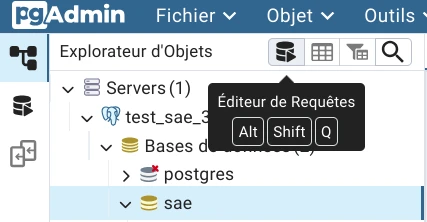
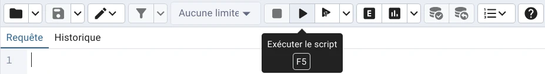

# SAÉ 3 & 4 - PACT by TripEnArvor

## Tuto comment se connecté au projet

  - Aller sur vsc 3ème onglet puis 1er bouton

  - 3petit point puis clone coller https://github.com/trethore/SAE3-PACT-TripEnArvor.git

  - puis pacer dans votre dossier de travail

dans le terminal :

  - `git config --global user.name "<nomGithub>"`

  - `git config --global user.email "<emailGithub>"`

Pour changer de branche :

  - `git pull`

  - puis en bas a gauche on peut changer de branche

## Serveur local de test avec `docker compose`

Si vous avez une ancienne version de Docker (inférieur à `20.10.13`), 
utilisez `docker-compose` avec un tiret au lieu de `docker compose` sans tiret.

### Mise en place

 1. Copiez le fichier `docker/.env.example` dans `docker/.env`.
    Modifiez les valeurs de `docker/.env` si nécessaire.<br>
    `docker/.env.example` est un fichier exemple accessible par tous le monde, 
    donc ne le modifiez pas et n'y mettez aucunes informations sensibles.

 2. Créez le fichier `html/php/connect_params.php` avec les information de 
    `docker/.env` sous la forme suivante :
    ```php
    <?php
    $server = 'postgresdb';
    $driver = 'pgsql';
    $dbname = 'sae'; // Valeur de `DB_NAME` dans `docker/.env`.
    $user   = 'sae'; // Valeur de `DB_USER` dans `docker/.env`.
    $pass	= 'test_password'; // Valeur de `DB_ROOT_PASSWORD` dans `docker/.env`.
    ```

 3. Lancer le serveur une première fois : dans un terminal, placez-vous dans le dossier `docker/`, 
    puis exécutez `docker compose up --build && docker compose logs -f`.

 4. Ouvrez pgAdmin à l'adresse `http://localhost:${PGADMIN_PORT}/`. 
    Remplacez `${PGADMIN_PORT}` par la valeur de `PGADMIN_PORT` dans `docker/.env`.
      - Identifiant : `${EQUIPE}@dbadmin-sae.com`
        Remplacez `${EQUIPE}` par la valeur de `EQUIPE` dans `docker/.env`, 
        utilisez la valeur que vous avez définit à la place de `equipe` dans l'identifiant.
      - Mot de passe :  Valeur de `PGADMIN_PASSWORD` dans `docker/.env` (par défaut `8081`).

 5. Ajoutez un serveur avec les information suivantes :

      - Onglet `Général`
          - Nom : Choisissez un nom, par exemple `test_sae_34`.

      - Onglet `Connexion`
          - `Nom d'hôte / Adresse` : `postgresdb`
          - `Base de données de maintenance` : Valeur de `DB_NAME` dans `docker/.env`.
          - `Identifiant` : Valeur de `DB_USER` dans `docker/.env`.
          - `Mot de passe` : Valeur de `DB_ROOT_PASSWORD` dans `docker/.env`.
    
        Laissez les valeurs par défaut pour le reste.

 6. Ouvrez l'éditeur de requêtes (`Alt` + `Shift` + `Q`)<br>
    

 7. Copier le contenu de `sql/createdb.sql` dans l'éditeur de requêtes puis exécutez le script (`F5`).<br>
    

 8. Faites de même avec le contenu de `sql/populate.sql`.

Après avoir effectuer ces étapes, le serveur local devrait être prêt.

### Lancement du serveur

Pour lancer le serveur, ouvrez un terminal dans `docker/` et exécutez 
`docker compose up && docker compose logs -f`.

### Accéder au site

Le site sera accessible à l’adresse `http://localhost:${PORT_WEB}/`.<br>
Remplacez `${PORT_WEB}` par la valeur de `PORT_WEB` dans `docker/.env` (par défaut `8080`).

### Arrêter le serveur

Pour arrêter le serveur sans supprimer les données du conteneur, 
ouvrez un terminal dans `docker/` et  exécutez `docker compose down`.<br>
Pour arrêter le serveur et supprimer les données du conteneur, 
ouvrez un terminal dans `docker/` et  exécutez `docker compose down -v`.

